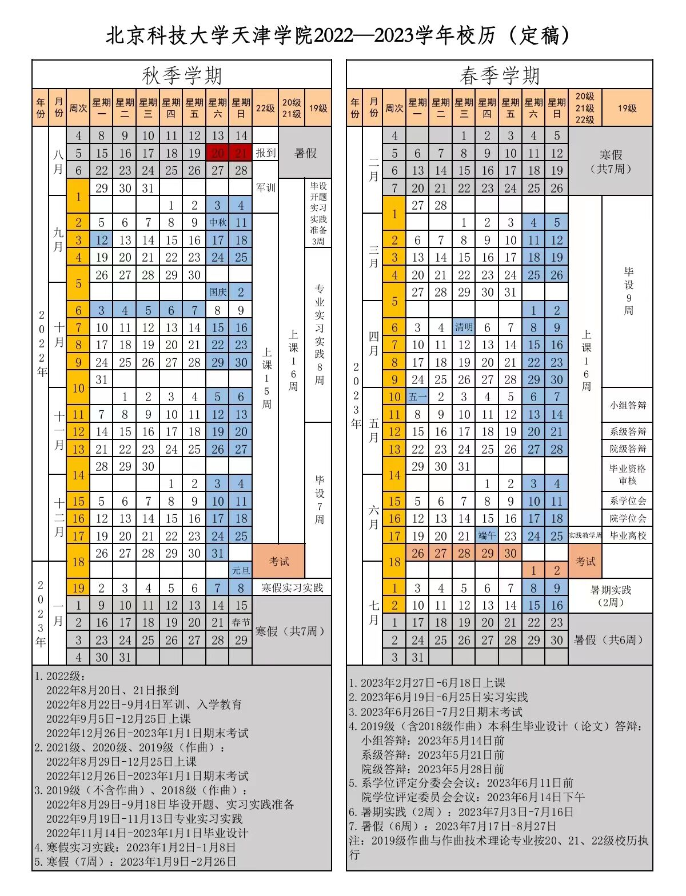

# 校历

* [校历](#校历)

* [往年校历](#往年校历)

## 校历

可长按保存

## 往年校历

- [2021~2022学年校历](images/calendar/2021-2022-0.png)
- [2020~2021学年校历](images/calendar/2020-2021-0.png)
- [2019~2020学年校历](images/calendar/2019-2020-0.jpeg)
- [2018~2019学年校历](images/calendar/2018-2019-1.png)

