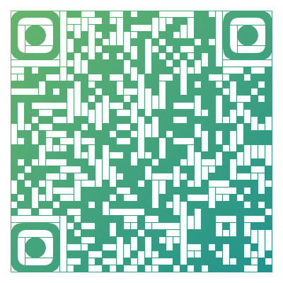

# 校园用网

* [寝室用网](#寝室用网)
* [图书馆用网](#图书馆用网)
* [教室用网](#教室用网)
* [更多](#更多)

## 寝室用网

宿舍自己的电脑若有上网需求，除手机流量开启Wi-Fi热点外，可以办理中国移动CMCC校园Wi-Fi或学院提供的校园网服务。

学校提供的校园网不同于中国移动CMCC校园网之处有以下区别：

|&nbsp;|校园网|移动CMCC|
|------|-----|-------|
|开通方式|关注”北京科技大学天津学院智慧校园“微信公众号等待开网注册通知办理|前往营业厅|
|接入方式|宿舍墙壁网线口，可自行外接无线路由器|Wi-Fi搜索连接|
|认证方式|Dr.COM客户端 或 弹出web portal登录认证|弹出web portal登录认证计费|
|网域|同时接入公网与学校大局域网，可不经过公网直接访问教务系统、图书馆等网站，甚至可以在机房教室通过IP地址连接上宿舍电脑|互不连通，仅可访问公网|
|计费方式|按时长计费。￥0.01元/分钟，即每小时￥0.6元|不详，待补充完善|
|故障维修|楼管报修，或拨打022-22410719|咨询校园移动营业厅|
|充值缴费|[易校园APP](https://h5.xiaofubao.com/app) - 充值网费、三食堂二楼自助充值机充值|校园移动营业厅|
|使用时段|全天可用(若外接路由器或交换机需考虑寝室断电情况)|全天可用，只要能搜到Wi-Fi信号|

## 图书馆用网

|&nbsp;|社科馆|理工馆|
|------|-----|-----|
|Wi-Fi|一、二楼部分区域可搜索到Wi-Fi，但网速体验不理想。如下： SSID：LIB 密码：12345678|无|
|网线接口|社科馆201室是电脑自习室，可自带电脑免费有线接入校园网|无|
|数字资源体验区|一楼大厅最中央圆环形区域|一楼借还处113室|
|电子阅览室|社科馆204|无|
>*：图书馆公用数字资源体验区以及电子阅览室电脑上机账号密码均为学号。

## 教室用网

- 8教、9教：不提供，教室多媒体电脑仅可访问学校内网，无法访问公网。
- 10教：根据上机课程需要，上课老师可申请开通公网访问。
- 其他：部分专业实验室或研究型教室，老师负责网络提供与管理。

## 更多

更多关于校园网相关内容请关注参阅“北京科技大学天津学院智慧校园”了解。 
(别抱太大期望，自从2020年疫情开始后，这号一直半死不活的没动静了╮(╯▽╰)╭)

