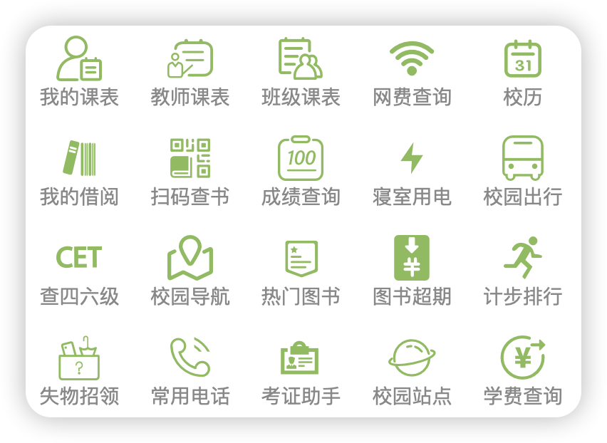

# 贝壳小盒子

* [简介](#简介)
* [如何使用](#如何使用)
* [账号密码](#账号密码)
    * [默认账号密码](#默认账号密码)
    * [忘记密码](#忘记密码)
    * [网费查询密码](#网费查询密码)
    * [借阅绑定密码](#借阅绑定密码)
    * [收费系统密码](#收费系统密码)
* [贝壳课程表](#贝壳课程表)
* [更多](#更多)

## 简介

贝壳小盒子是一款微信/QQ小程序，具有课表查询、校园网费用查询、校历查询、图书查询、图书续借、成绩查询、宿舍电费查询、学费查询...等多项功能。是你在贝壳田园校园生活不可或缺的法宝利器。

- 主页：[https://dev.shellbox.airmole.cn/](https://dev.shellbox.airmole.cn/)

## 如何使用

### 方式一

访问[https://dev.shellbox.airmole.cn/](https://dev.shellbox.airmole.cn/)点击对应版本的按钮，微信版长按识别二维码即可打开，QQ版点击按钮自动打开。

### 方式二

使用QQ/微信扫描下方对应的小程序码即可启动打开

### 方式三

使用微信搜一搜、QQ搜索栏搜索关键字“贝壳小盒子”

## 账号密码

### 默认账号密码

贝壳小盒子登录密码与学校教务系统账号密码保持一致，即账号一般为学号，密码一般初始默认为身份证号码或身份证号码后6位(X大写)。

- 教师用户账号使用教务系统账号。
- 大一新生没有学号，耐心待学校注册学籍，分配好教务账号后即可使用。

### 忘记密码

先尝试[教务系统](http://61.181.145.1:89/jsxsd/)的忘记密码功能，若无法成功找回密码，请携带本人证件前往学校十二教教务处，请工作人员协助重置教务系统密码。

- [教务系统-忘记密码功能操作文档](https://docs.qq.com/doc/DRElaRGJFanBOYkZr)

### 网费查询密码

使用本功能前，请先确保您开通了学校的校园网账号。
关于自己是否开通校园网账号以及如何开通办理见[宿舍生活 - 用网](dormitory/internet.md)章节内容

- 默认账号：学号
- 默认密码：关注“北京科技大学天津学院智慧校园”公众号，发送“默认密码”获取

### 借阅绑定密码

- 账号：学号
- 默认密码：身份证号后6位(X大写)或与学号相同

> 忘记密码请携带证件前往图书馆借还处重置。

### 收费系统密码

- 账号：学号
- 密码：身份证号码后六位(X大写)

> 大一新生未注册学籍前，账号可能是高考考生号。具体以学校通知为准。

## 贝壳课程表

贝壳课程表是将贝壳小盒子“我的课表”部分功能单独剥离出来，专门提供课表功能服务的安卓APP，其不同于贝壳小盒子功能定位之处在于只有课表功能，且支持安卓桌面小组件。无需打开APP或小程序，在手机桌面即可看到课表信息。

但其短板在于：
一、目前仅支持安卓手机，暂无iOS端APP(要想上架iOS应用需要注册公司，还得缴纳一笔不小的苹果税)。
二、贝壳课程表采用导入课程机制，一次导入后不会自动更新，而贝壳小盒子每次打开课表都会获取最新的课表信息。

- [下载链接](https://gitee.com/airmole/shellbox-schedule-kotlin/attach_files/987384/download/shellbox_schedule_1_0_1.apk)

## 更多

如果您还有其他关于贝壳小盒子使用上的问题或意见反馈，可以加入，参与讨论。