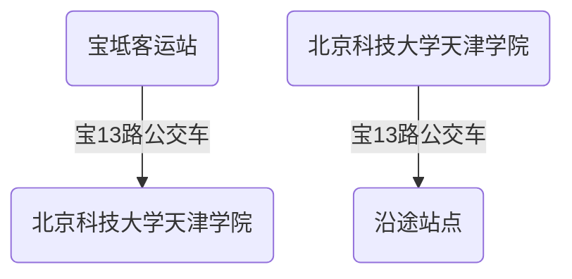

# 宝坻方向往返

* [方案一 公共交通](#方案一：公共交通)
    * [发车时间及票价](#发车时间及票价)
* [方案二 驾车](#方案二：驾车)

## 方案一：公共交通

### 发车时间及票价

> 首班时间：06:30

> 末班时间：17:30

> 票价：按距离￥2~￥6元

|往宝坻方向(上午)|往学校方向(上午)|往宝坻方向(下午)|往学校方向(下午)|
|---|---|---|---|
|6:30|6:30|12:30|12:30|
|7:00|7:00|13:00|13:00|
|7:30|7:30|13:30|13:30|
|8:00|8:00|14:00|14:00|
|8:30|8:30|14:30|14:30|
|9:00|9:00|15:00|15:00|
|9:30|9:30|15:30|15:30|
|10:00|10:00|16:00|16:00|
|10:30|10:30|16:30|16:30|
|11:00|11:00|17:00|17:00|
|11:30|11:30|17:30|17:30|
|12:00|12:00|&nbsp;|&nbsp;|

> 发车时刻仅供参考，建议提前候车以实际情况为准。

长按识别打开小程序可查看沿途站点

## 方案二：驾车

<iframe style="width: 100%;height: 500px;" src="https://j.map.baidu.com/86/pZ5c"></iframe>
