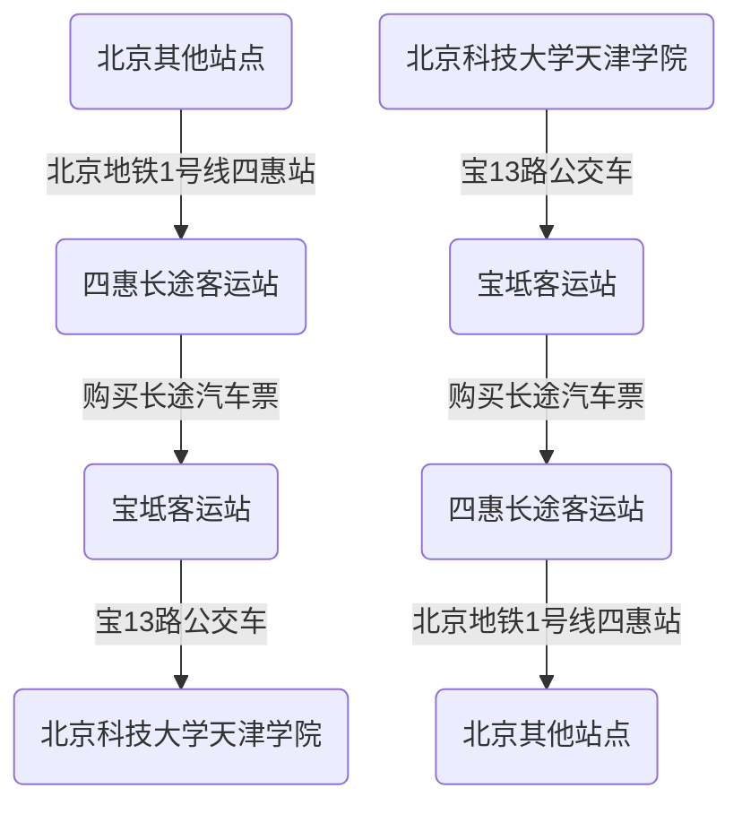
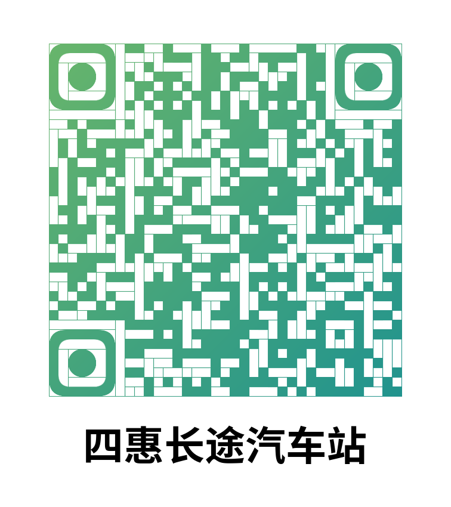
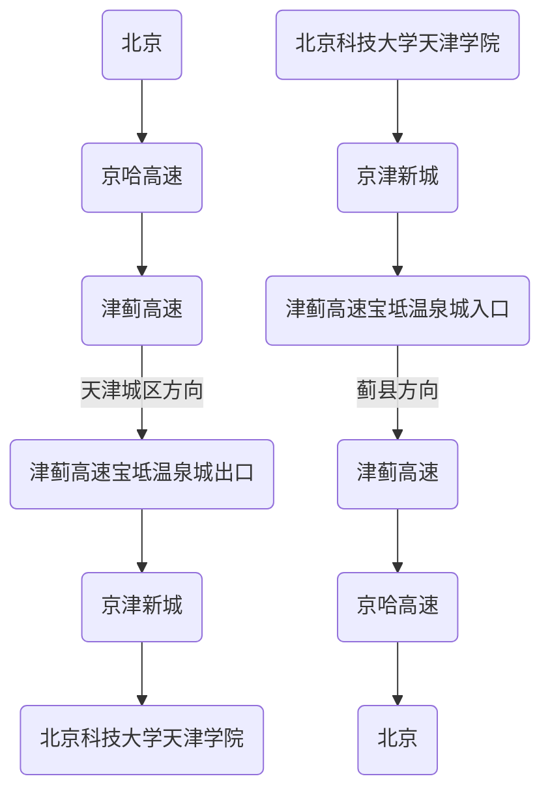

# 北京方向往返

* [方案一 公共交通](#方案一：公共交通)
* [方案二 驾车](#方案二：驾车)

## 方案一：公共交通

```mermaid
graph TD
A(北京其他站点) --> |北京地铁1号线四惠站| B(四惠长途客运站)
B --> |购买长途汽车票| C(宝坻客运站)
C --> |宝13路公交车| D(北京科技大学天津学院)

E(北京科技大学天津学院) --> |宝13路公交车| F(宝坻客运站)
F --> |购买长途汽车票| G(四惠长途客运站)
G --> |北京地铁1号线四惠站| H(北京其他站点)
```

微信扫描下方公众号二维码可购四惠客运站车票

## 方案二：驾车

```mermaid
graph TD
A(北京) --> B(京哈高速)
B --> C(津蓟高速)
C --> |天津城区方向| D(津蓟高速宝坻温泉城出口)
D --> E(京津新城)
E --> F(北京科技大学天津学院)

G(北京科技大学天津学院) --> H(京津新城)
H --> I(津蓟高速宝坻温泉城入口)
I --> |蓟县方向| J(津蓟高速)
J --> K(京哈高速)
K --> L(北京)
```

<iframe style="width: 100%;height: 500px;" src="https://j.map.baidu.com/2b/H-5c"></iframe>