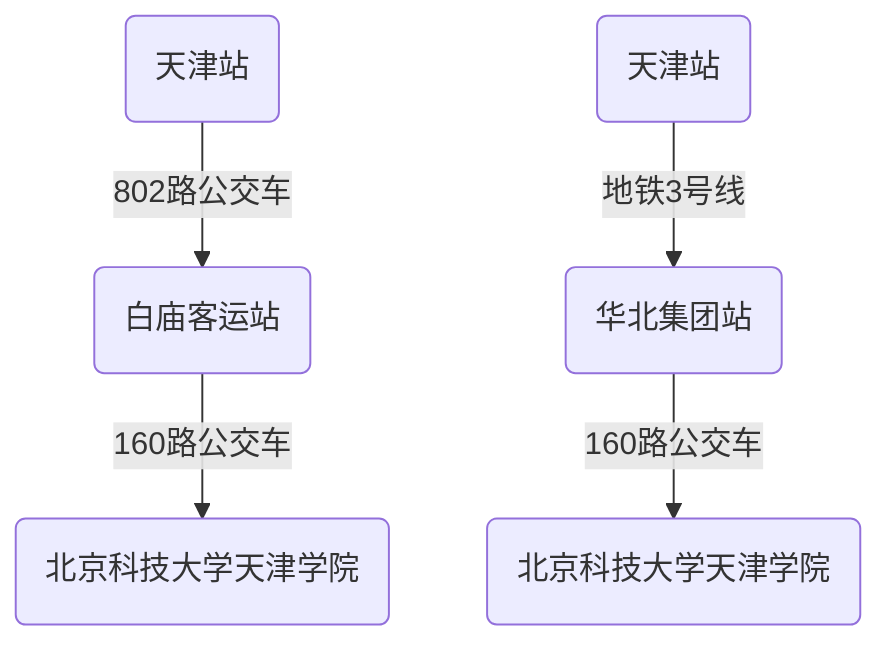
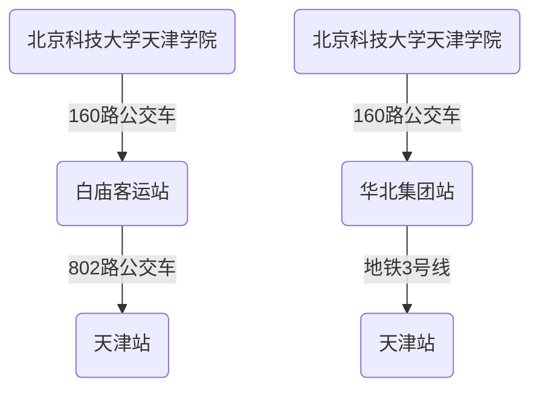
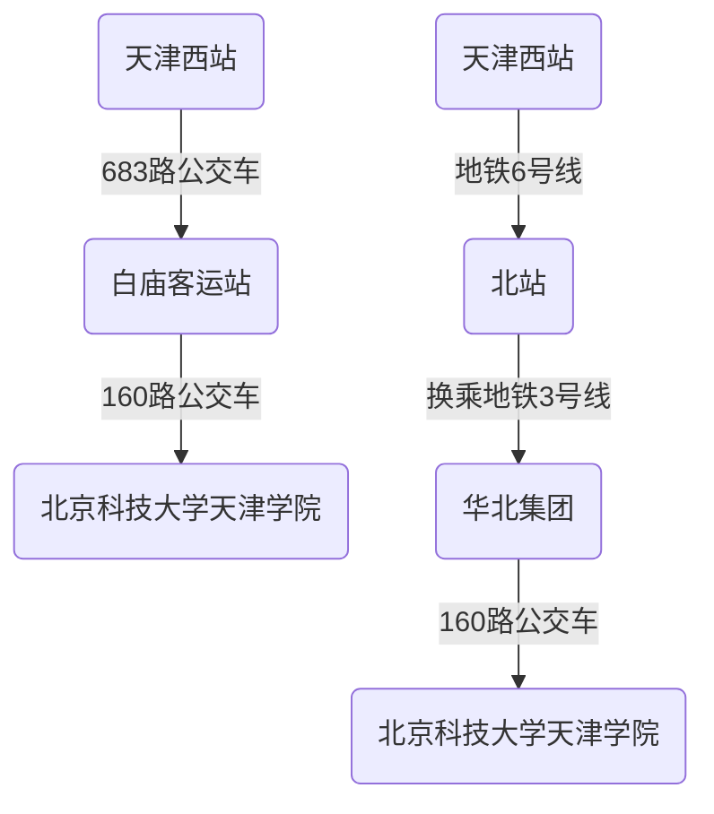
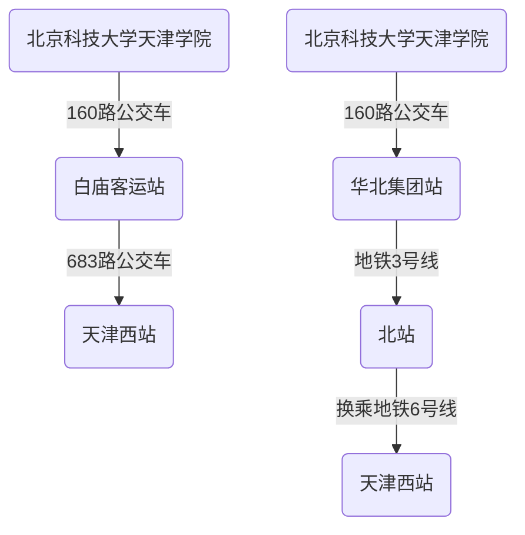
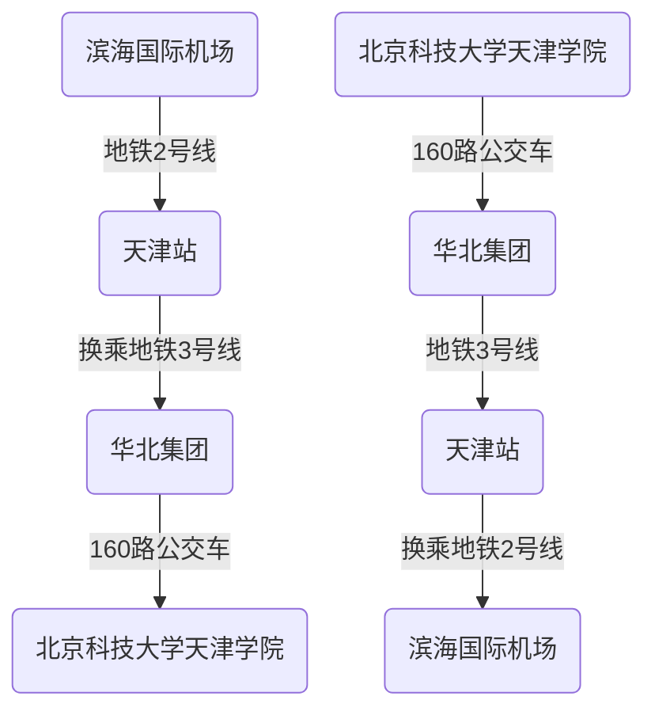
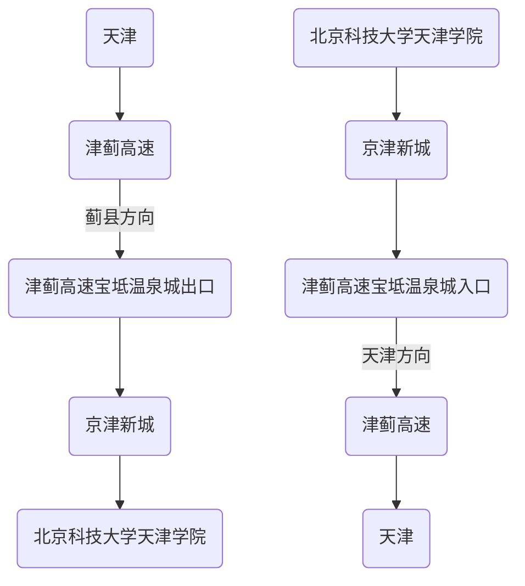

# 天津方向往返

* [160路公交车](#160路公交车)
* [天津站](#天津站)
* [天津西站](#天津西站)
* [滨海机场](#滨海机场)
* [自驾](#自驾)

## 160路公交车

### 发车时间及票价

> 票价：按距离￥5~￥15元

> 京津新城至白庙: 5:10~17:00,约30分/班

> 白庙至京津新城: 7:30~19:00,约30分/班

|往天津市区方向(上午)|往学校方向(上午)|往天津市区方向(下午)|往学校方向(下午)|
|---|---|---|---|
|5:10|7:30|13:10|13:30|
|5:40|8:30|14:00|14:20|
|6:30|9:20|14:50|15:10|
|7:20|10:10|15:30|16:00|
|8:10|11:50|16:10|16:50|
|9:00|&nbsp;|17:00|17:30|
|9:50|&nbsp;|&nbsp;|18:30|
|10:40|&nbsp;|&nbsp;|19:00|
|11:30|&nbsp;|&nbsp;|&nbsp;|
|12:10|&nbsp;|&nbsp;|&nbsp;|

> 发车时刻仅供参考，建议提前候车以实际情况为准。

长按识别打开小程序可查看沿途站点

## 天津站

## 天津西站

## 滨海机场

## 自驾

<iframe style="width: 100%;height: 500px;" src="https://j.map.baidu.com/21/efDc"></iframe>